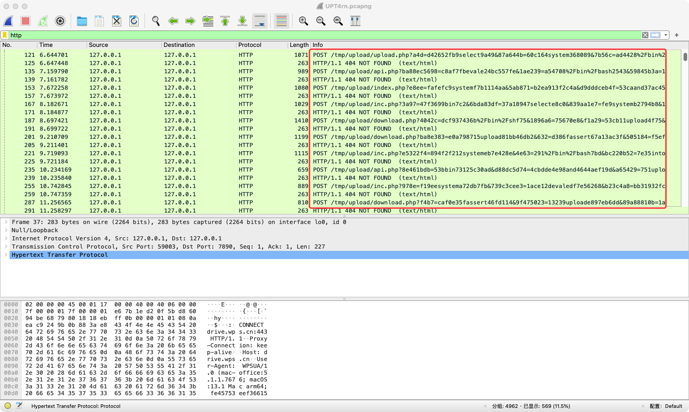
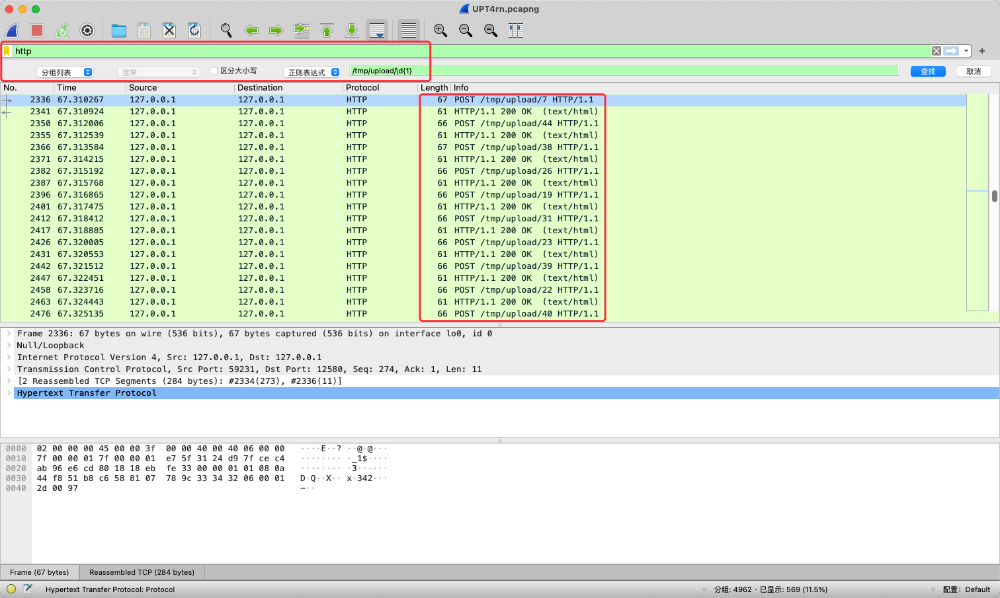
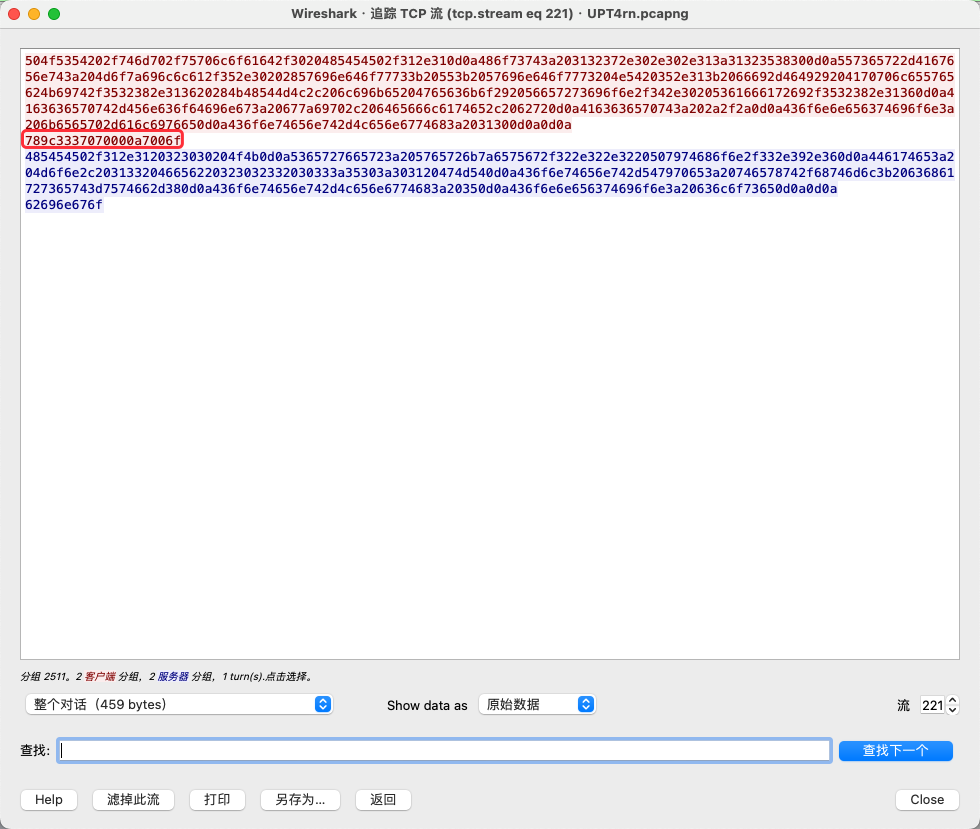
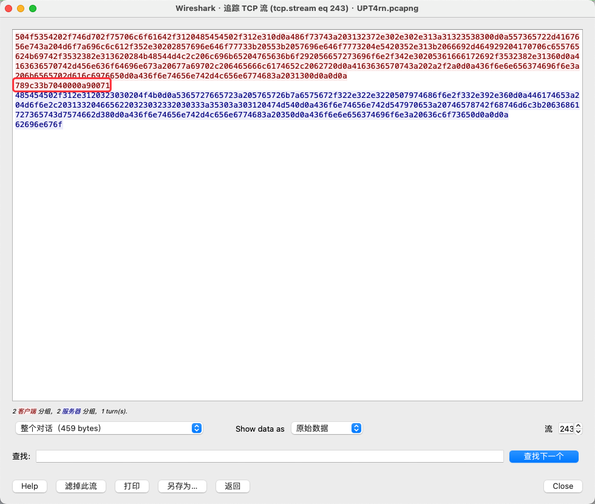
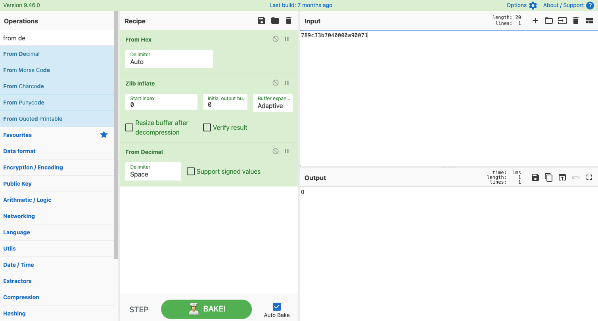

### [Name]：

```
UPT4rn
```

### [Author]

```
1cePeak@Nepnep
```

### [Description]：

```
No One Know Upload than T4rn:)
```

### [Key Point]：
```bash
1. Traffic Upload Analysis
2. zlib data decrypt
```

### [Flag]:
`MOCSCTF{No_oNe_kn0W_UP1O@d_2l18_d@TA_Th4N_T4Rn}`

### [Writeup]：

First, upon analyzing the traffic, it was discovered that there was a large amount of junk traffic.



After filtering, it was found that T4rn had uploaded 47 valid data to the directory /tmp/upload/(\d){1}. 



By tracing the TCP stream and analyzing the data, we finally determined that the traffic was encrypted with zlib.compress. The uploaded content can be decrypted by calling zlib.decompress in sequence according to the number of the uploaded data.








Then, we will flagged:
`MOCSCTF{No_oNe_kn0W_UP1O@d_2l18_d@TA_Th4N_T4Rn}`
