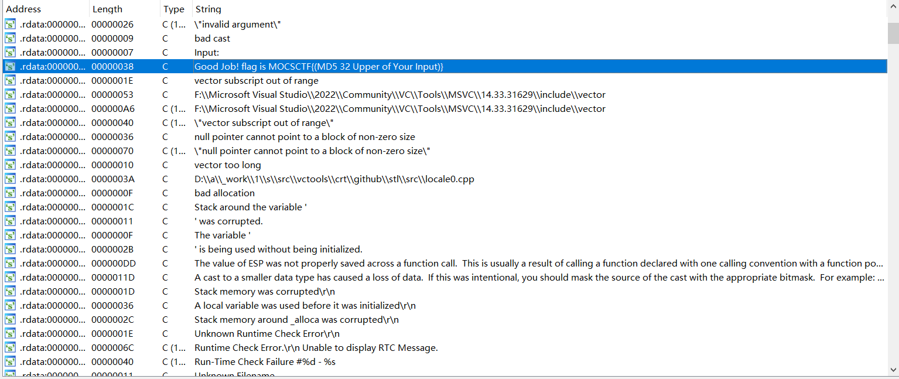
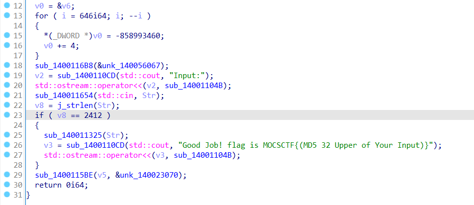
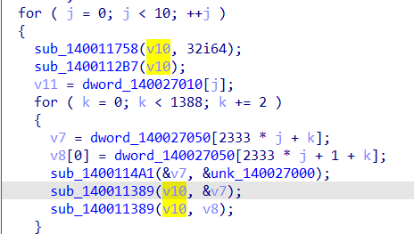
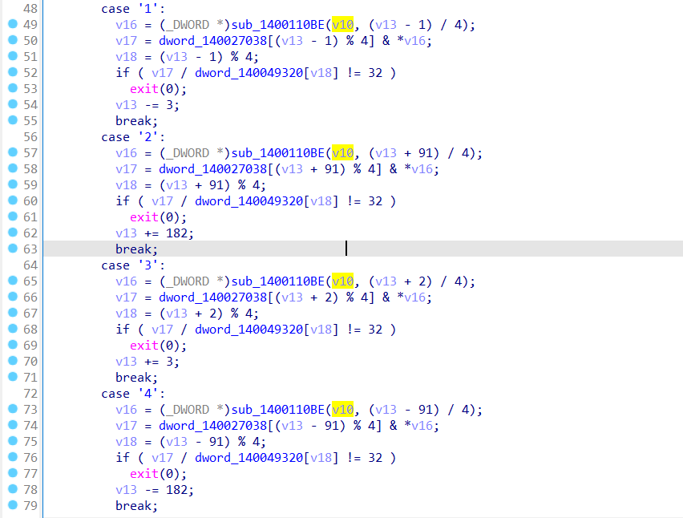

# 題目writeup

首先可以簡單地通過字符串窗口定位到主函數的位置



這裡顯然看出要求輸入 2412 位，sub_140011325() 為 check 的函數



sub_1400114A1() 是 XXTEA 解密函數，相應地，unk_140027000數組是 XXTEA 的密鑰，dword_140027050 數組為解密的數據。將其解密後會發現其為一張地圖。

聯繫後續循環可以發現我們將輸入分割成了 10 段，並且 dword_140027010 數組保存了每一段的長度。

本題的一個難點在於發現 v10 是一個 vector 數組，並且 sub_140011389() 是 vector STL 中的 push_back() 函數，識別出這一點後，後續的程序邏輯分析會更加輕鬆。



這裡是迷宮的移動部分。sub_1400110BE() 是 vector STL 中讀取相應下標的值，並且每個 case 下均對存儲的值做了一個十六進制下的移位操作。形如 0x12345678，若模 4 的結果為 0 就取出 0x12，若為 1 就取出 0x34。



在與之前 XXTEA 解密出的數據對比後，可以發現解密出的數據有且僅有'+'，'-'，' '，'|'四種字符，與此處對照就能發現迷宮的行進流程與迷宮的行列長度。最終，解密出全部十張地圖，並且寫出尋路腳本即可完成本題。

此處以第一張地圖為例給出地圖的解密腳本與尋路腳本。

```c
#include <stdio.h>
#define uint unsigned int
#define MX (((z >> 5 ^ y << 2) + (y >> 3 ^ z << 4)) ^ ((sum ^ y) + (k[(i & 3) ^ e] ^ z)))

uint test_en[] = 
{1143305790, 2983753100, 84108505, 2010522858, 61790376, 2709765896, 1143305790, 2983753100, 84108505, 2010522858, 61790376, 2709765896, 1143305790, 2983753100, 84108505, 2010522858, 61790376, 2709765896, 1143305790, 2983753100, 84108505, 2010522858, 4161887845, 1741815882, 2400933737, 972326227, 429528119, 1570728339, 3808619224, 1284714316, 1474086087, 2259947478, 2400933737, 972326227, 3808619224, 1284714316, 1756239190, 432016825, 2400933737, 972326227, 4226230088, 3140666390, 2400933737, 972326227, 644489592, 2810720486, 2469991831, 1137436596, 1383254999, 74604979, 2613937221, 2505334101, 660846943, 3626546427, 1442183423, 3675734655, 1480206840, 3304146204, 187231624, 3146296156, 945010099, 15000839, 2218239991, 2460982000, 1556080558, 4218675384, 1383254999, 74604979, 3252086478, 4269648697, 429528119, 1570728339, 1789199813, 1768622804, 3531398638, 4048768292, 429528119, 1570728339, 144588340, 1358069742, 1745561367, 3322904360, 2905129298, 292299181, 885668636, 1072305462, 1756239190, 432016825, 2905129298, 292299181, 2954738181, 2323465450, 1383254999, 74604979, 188331832, 1269569821, 2469991831, 1137436596, 945010099, 15000839, 1143305790, 2983753100, 3158593649, 2853844316, 4122079880, 723765176, 2218239991, 2460982000, 187231624, 3146296156, 1618577587, 2235259581, 3918199358, 1894966447, 429528119, 1570728339, 3808619224, 1284714316, 1550249287, 2575895049, 2545444210, 693662304, 144588340, 1358069742, 3385937846, 259469291, 2545444210, 693662304, 885668636, 1072305462, 1745561367, 3322904360, 429528119, 1570728339, 1789199813, 1768622804, 3860060404, 344024243, 1143305790, 2983753100, 3665436144, 1068694973, 1618577587, 2235259581, 188331832, 1269569821, 2469991831, 1137436596, 1618577587, 2235259581, 1211526031, 2082440900, 3158593649, 2853844316, 3424964758, 4022646126, 1211526031, 2082440900, 3747419541, 3567727535, 4226230088, 3140666390, 837315866, 3523057819, 2400933737, 972326227, 1381615436, 3643845622, 3531398638, 4048768292, 429528119, 1570728339, 1381615436, 3643845622, 3531398638, 4048768292, 2905129298, 292299181, 1789199813, 1768622804, 1745561367, 3322904360, 3115792901, 2855847552, 187231624, 3146296156, 1442183423, 3675734655, 2218239991, 2460982000, 1556080558, 4218675384, 1442183423, 3675734655, 2218239991, 2460982000, 187231624, 3146296156, 1618577587, 2235259581, 2613937221, 2505334101, 660846943, 3626546427, 2923546743, 1590590864, 837315866, 3523057819, 2400933737, 972326227, 885668636, 1072305462, 3385937846, 259469291, 429528119, 1570728339, 1789199813, 1768622804, 1756239190, 432016825, 429528119, 1570728339, 1789199813, 1768622804, 1550249287, 2575895049, 2156450104, 2828043906, 3895395679, 898912113, 4122079880, 723765176, 1143305790, 2983753100, 660846943, 3626546427, 1383254999, 74604979, 1211526031, 2082440900, 660846943, 3626546427, 1618577587, 2235259581, 2218239991, 2460982000, 2469991831, 1137436596, 1442183423, 3675734655, 3252086478, 4269648697, 2400933737, 972326227, 3808619224, 1284714316, 1474086087, 2259947478, 2905129298, 292299181, 1381615436, 3643845622, 1550249287, 2575895049, 429528119, 1570728339, 885668636, 1072305462, 1756239190, 432016825, 2545444210, 693662304, 1534384316, 3454732882, 4122079880, 723765176, 1211526031, 2082440900, 84108505, 2010522858, 1442183423, 3675734655, 2218239991, 2460982000, 1556080558, 4218675384, 3424964758, 4022646126, 1143305790, 2983753100, 3158593649, 2853844316, 1442183423, 3675734655, 3918199358, 1894966447, 2905129298, 292299181, 885668636, 1072305462, 1550249287, 2575895049, 429528119, 1570728339, 1381615436, 3643845622, 1756239190, 432016825, 2545444210, 693662304, 3808619224, 1284714316, 1474086087, 2259947478, 2545444210, 693662304, 144588340, 1358069742, 1006547674, 239344705, 2218239991, 2460982000, 1556080558, 4218675384, 945010099, 15000839, 2218239991, 2460982000, 187231624, 3146296156, 1383254999, 74604979, 1264005199, 1283112749, 3665436144, 1068694973, 1383254999, 74604979, 1143305790, 2983753100, 3747419541, 3567727535, 4226230088, 3140666390, 1745561367, 3322904360, 2905129298, 292299181, 144588340, 1358069742, 1745561367, 3322904360, 2905129298, 292299181, 1789199813, 1768622804, 837315866, 3523057819, 2400933737, 972326227, 144588340, 1358069742, 3531398638, 4048768292, 1211526031, 2082440900, 3665436144, 1068694973, 945010099, 15000839, 1143305790, 2983753100, 660846943, 3626546427, 1442183423, 3675734655, 1264005199, 1283112749, 3158593649, 2853844316, 1240469823, 1405742493, 3115792901, 2855847552, 187231624, 3146296156, 2734426591, 3330399055, 1756239190, 432016825, 2545444210, 693662304, 2400933737, 972326227, 3385937846, 259469291, 2545444210, 693662304, 1381615436, 3643845622, 837315866, 3523057819, 2400933737, 972326227, 4226230088, 3140666390, 3385937846, 259469291, 2156450104, 2828043906, 187231624, 3146296156, 1383254999, 74604979, 1264005199, 1283112749, 660846943, 3626546427, 1442183423, 3675734655, 2218239991, 2460982000, 187231624, 3146296156, 61790376, 2709765896, 188331832, 1269569821, 1556080558, 4218675384, 1618577587, 2235259581, 3252086478, 4269648697, 2905129298, 292299181, 1789199813, 1768622804, 3385937846, 259469291, 429528119, 1570728339, 4226230088, 3140666390, 3531398638, 4048768292, 2400933737, 972326227, 2400933737, 972326227, 3531398638, 4048768292, 2400933737, 972326227, 3190300280, 4157403570, 1240469823, 1405742493, 1211526031, 2082440900, 660846943, 3626546427, 4122079880, 723765176, 1264005199, 1283112749, 3665436144, 1068694973, 61790376, 2709765896, 1143305790, 2983753100, 84108505, 2010522858, 1240469823, 1405742493, 455449482, 3809203849, 429528119, 1570728339, 885668636, 1072305462, 837315866, 3523057819, 2545444210, 693662304, 144588340, 1358069742, 3385937846, 259469291, 2400933737, 972326227, 2400933737, 972326227, 2400933737, 972326227, 2905129298, 292299181, 2400933737, 972326227, 3860060404, 344024243, 188331832, 1269569821, 2469991831, 1137436596, 3424964758, 4022646126, 1211526031, 2082440900, 660846943, 3626546427, 61790376, 2709765896, 1143305790, 2983753100, 660846943, 3626546427, 1618577587, 2235259581, 1143305790, 2983753100, 3747419541, 3567727535, 4226230088, 3140666390, 1550249287, 2575895049, 429528119, 1570728339, 4226230088, 3140666390, 1474086087, 2259947478, 2400933737, 972326227, 144588340, 1358069742, 3531398638, 4048768292, 2400933737, 972326227, 1789199813, 1768622804, 1474086087, 2259947478, 1264005199, 1283112749, 3665436144, 1068694973, 61790376, 2709765896, 1143305790, 2983753100, 3665436144, 1068694973, 61790376, 2709765896, 188331832, 1269569821, 187231624, 3146296156, 4122079880, 723765176, 2218239991, 2460982000, 3895395679, 898912113, 3678242491, 2366319739, 3385937846, 259469291, 2400933737, 972326227, 2400933737, 972326227, 3385937846, 259469291, 2400933737, 972326227, 4226230088, 3140666390, 3385937846, 259469291, 429528119, 1570728339, 885668636, 1072305462, 3385937846, 259469291, 644489592, 2810720486, 187231624, 3146296156, 1240469823, 1405742493, 1143305790, 2983753100, 660846943, 3626546427, 1442183423, 3675734655, 1480206840, 3304146204, 3895395679, 898912113, 61790376, 2709765896, 188331832, 1269569821, 3895395679, 898912113, 3424964758, 4022646126, 49366273, 1858558404, 429528119, 1570728339, 4226230088, 3140666390, 3531398638, 4048768292, 2545444210, 693662304, 144588340, 1358069742, 2400933737, 972326227, 2400933737, 972326227, 1789199813, 1768622804, 3531398638, 4048768292, 2905129298, 292299181, 2954738181, 2323465450, 3424964758, 4022646126, 188331832, 1269569821, 187231624, 3146296156, 945010099, 15000839, 1264005199, 1283112749, 84108505, 2010522858, 61790376, 2709765896, 2218239991, 2460982000, 3895395679, 898912113, 945010099, 15000839, 4135671673, 2341668903, 2905129298, 292299181, 1789199813, 1768622804, 1756239190, 432016825, 429528119, 1570728339, 898901732, 1408795500, 2400933737, 972326227, 2905129298, 292299181, 2400933737, 972326227, 1756239190, 432016825, 2545444210, 693662304, 4226230088, 3140666390, 1008149178, 674231472, 2218239991, 2460982000, 2469991831, 1137436596, 61790376, 2709765896, 1143305790, 2983753100, 3665436144, 1068694973, 1240469823, 1405742493, 1264005199, 1283112749, 660846943, 3626546427, 1442183423, 3675734655, 1211526031, 2082440900, 3747419541, 3567727535, 2400933737, 972326227, 3531398638, 4048768292, 2400933737, 972326227, 898901732, 1408795500, 837315866, 3523057819, 2905129298, 292299181, 898901732, 1408795500, 2400933737, 972326227, 429528119, 1570728339, 1381615436, 3643845622, 3531398638, 4048768292, 1264005199, 1283112749, 84108505, 2010522858, 4122079880, 723765176, 3115792901, 2855847552, 187231624, 3146296156, 945010099, 15000839, 1143305790, 2983753100, 3665436144, 1068694973, 61790376, 2709765896, 1211526031, 2082440900, 3665436144, 1068694973, 3678242491, 2366319739, 3385937846, 259469291, 2905129298, 292299181, 144588340, 1358069742, 837315866, 3523057819, 2545444210, 693662304, 2400933737, 972326227, 3531398638, 4048768292, 2905129298, 292299181, 898901732, 1408795500, 3385937846, 259469291, 644489592, 2810720486, 2469991831, 1137436596, 4122079880, 723765176, 2218239991, 2460982000, 3895395679, 898912113, 1442183423, 3675734655, 2613937221, 2505334101, 660846943, 3626546427, 1383254999, 74604979, 1264005199, 1283112749, 660846943, 3626546427, 1618577587, 2235259581, 3252086478, 4269648697, 429528119, 1570728339, 4226230088, 3140666390, 1756239190, 432016825, 429528119, 1570728339, 3808619224, 1284714316, 3531398638, 4048768292, 2905129298, 292299181, 1789199813, 1768622804, 1474086087, 2259947478, 2400933737, 972326227, 1534384316, 3454732882, 945010099, 15000839, 1480206840, 3304146204, 187231624, 3146296156, 1383254999, 74604979, 1264005199, 1283112749, 3158593649, 2853844316, 1442183423, 3675734655, 1211526031, 2082440900, 660846943, 3626546427, 61790376, 2709765896, 2488839420, 2395362615, 2400933737, 972326227, 4226230088, 3140666390, 837315866, 3523057819, 2905129298, 292299181, 144588340, 1358069742, 837315866, 3523057819, 429528119, 1570728339, 885668636, 1072305462, 1550249287, 2575895049, 429528119, 1570728339, 144588340, 1358069742, 1006547674, 239344705, 2613937221, 2505334101, 3665436144, 1068694973, 1618577587, 2235259581, 3115792901, 2855847552, 2469991831, 1137436596, 945010099, 15000839, 3115792901, 2855847552, 187231624, 3146296156, 1383254999, 74604979, 188331832, 1269569821, 648486259, 174916896, 3808619224, 1284714316, 3531398638, 4048768292, 2400933737, 972326227, 1789199813, 1768622804, 3531398638, 4048768292, 2545444210, 693662304, 3808619224, 1284714316, 1745561367, 3322904360, 2545444210, 693662304, 1381615436, 3643845622, 837315866, 3523057819, 1211526031, 2082440900, 84108505, 2010522858, 945010099, 15000839, 2218239991, 2460982000, 1556080558, 4218675384, 1442183423, 3675734655, 2218239991, 2460982000, 187231624, 3146296156, 3424964758, 4022646126, 2218239991, 2460982000, 3895395679, 898912113, 2734426591, 3330399055, 1474086087, 2259947478, 2905129298, 292299181, 885668636, 1072305462, 3385937846, 259469291, 429528119, 1570728339, 1381615436, 3643845622, 1756239190, 432016825, 429528119, 1570728339, 4226230088, 3140666390, 3531398638, 4048768292, 644489592, 2810720486, 3895395679, 898912113, 945010099, 15000839, 1480206840, 3304146204, 2469991831, 1137436596, 1383254999, 74604979, 2218239991, 2460982000, 187231624, 3146296156, 1618577587, 2235259581, 3115792901, 2855847552, 187231624, 3146296156, 3424964758, 4022646126, 2219653652, 1750654152, 2400933737, 972326227, 4226230088, 3140666390, 837315866, 3523057819, 2905129298, 292299181, 1789199813, 1768622804, 1745561367, 3322904360, 429528119, 1570728339, 144588340, 1358069742, 1756239190, 432016825, 2545444210, 693662304, 2797599418, 2689443674, 4122079880, 723765176, 2613937221, 2505334101, 3665436144, 1068694973, 1442183423, 3675734655, 1480206840, 3304146204, 2469991831, 1137436596, 945010099, 15000839, 3115792901, 2855847552, 1556080558, 4218675384, 1618577587, 2235259581, 4135671673, 2341668903, 2905129298, 292299181, 144588340, 1358069742, 1756239190, 432016825, 2905129298, 292299181, 144588340, 1358069742, 3531398638, 4048768292, 2545444210, 693662304, 2400933737, 972326227, 3385937846, 259469291, 2400933737, 972326227, 885668636, 1072305462, 1006547674, 239344705, 1480206840, 3304146204, 2469991831, 1137436596, 61790376, 2709765896, 3115792901, 2855847552, 1556080558, 4218675384, 945010099, 15000839, 2613937221, 2505334101, 84108505, 2010522858, 61790376, 2709765896, 3115792901, 2855847552, 648486259, 174916896, 3808619224, 1284714316, 1756239190, 432016825, 2400933737, 972326227, 144588340, 1358069742, 1756239190, 432016825, 2545444210, 693662304, 898901732, 1408795500, 1550249287, 2575895049, 2905129298, 292299181, 885668636, 1072305462, 1474086087, 2259947478, 1264005199, 1283112749, 3158593649, 2853844316, 61790376, 2709765896, 2218239991, 2460982000, 1556080558, 4218675384, 1383254999, 74604979, 3115792901, 2855847552, 187231624, 3146296156, 1618577587, 2235259581, 2218239991, 2460982000, 1556080558, 4218675384, 2923546743, 1590590864, 1474086087, 2259947478, 2905129298, 292299181, 898901732, 1408795500, 3385937846, 259469291, 429528119, 1570728339, 1789199813, 1768622804, 3385937846, 259469291, 429528119, 1570728339, 4226230088, 3140666390, 1550249287, 2575895049, 63755503, 1858640760, 84108505, 2010522858, 1442183423, 3675734655, 1264005199, 1283112749, 84108505, 2010522858, 1383254999, 74604979, 3115792901, 2855847552, 3895395679, 898912113, 1618577587, 2235259581, 1143305790, 2983753100, 3665436144, 1068694973, 1618577587, 2235259581, 3510127753, 3833285039, 429528119, 1570728339, 1789199813, 1768622804, 1550249287, 2575895049, 2905129298, 292299181, 1789199813, 1768622804, 3385937846, 259469291, 2905129298, 292299181, 144588340, 1358069742, 3385937846, 259469291, 2400933737, 972326227, 2954738181, 2323465450, 4122079880, 723765176, 1211526031, 2082440900, 3158593649, 2853844316, 1618577587, 2235259581, 2218239991, 2460982000, 3895395679, 898912113, 1442183423, 3675734655, 2218239991, 2460982000, 1556080558, 4218675384, 61790376, 2709765896, 4135671673, 2341668903, 429528119, 1570728339, 885668636, 1072305462, 837315866, 3523057819, 429528119, 1570728339, 1789199813, 1768622804, 3531398638, 4048768292, 429528119, 1570728339, 1381615436, 3643845622, 3385937846, 259469291, 2905129298, 292299181, 144588340, 1358069742, 1006547674, 239344705, 2218239991, 2460982000, 2469991831, 1137436596, 3424964758, 4022646126, 1211526031, 2082440900, 660846943, 3626546427, 3424964758, 4022646126, 1480206840, 3304146204, 3895395679, 898912113, 1618577587, 2235259581, 1211526031, 2082440900, 3747419541, 3567727535, 885668636, 1072305462, 3531398638, 4048768292, 2905129298, 292299181, 1789199813, 1768622804, 3385937846, 259469291, 2545444210, 693662304, 144588340, 1358069742, 3531398638, 4048768292, 2905129298, 292299181, 885668636, 1072305462, 1474086087, 2259947478, 1480206840, 3304146204, 1556080558, 4218675384, 4122079880, 723765176, 2613937221, 2505334101, 660846943, 3626546427, 1618577587, 2235259581, 1264005199, 1283112749, 3665436144, 1068694973, 3424964758, 4022646126, 2218239991, 2460982000, 3895395679, 898912113, 3678242491, 2366319739, 3385937846, 259469291, 429528119, 1570728339, 4226230088, 3140666390, 837315866, 3523057819, 429528119, 1570728339, 885668636, 1072305462, 1550249287, 2575895049, 2545444210, 693662304, 1381615436, 3643845622, 3531398638, 4048768292, 644489592, 2810720486, 1556080558, 4218675384, 61790376, 2709765896, 2218239991, 2460982000, 2469991831, 1137436596, 3424964758, 4022646126, 3115792901, 2855847552, 187231624, 3146296156, 1618577587, 2235259581, 2218239991, 2460982000, 3895395679, 898912113, 1442183423, 3675734655, 2219653652, 1750654152, 2400933737, 972326227, 2400933737, 972326227, 1550249287, 2575895049, 429528119, 1570728339, 144588340, 1358069742, 1474086087, 2259947478, 2400933737, 972326227, 898901732, 1408795500, 1550249287, 2575895049, 2400933737, 972326227, 1534384316, 3454732882, 61790376, 2709765896, 1143305790, 2983753100, 84108505, 2010522858, 61790376, 2709765896, 1143305790, 2983753100, 84108505, 2010522858, 61790376, 2709765896, 1143305790, 2983753100, 84108505, 2010522858, 61790376, 2709765896, 28314045, 2802287285};
void xxtea(uint *v, int n, uint *k)  
{
	uint y, z, sum, i, t, e, delta = 0x98765432;
	n = -n, t = 6 + 52 / n, sum = t * delta, y = v[0];
	while (t--)
	{
		e = (sum >> 2) & 3;
		for (i = n - 1; i > 0; --i)
		{
			z = v[i - 1];
			y = v[i] -= MX;
		}
		z = v[n - 1];
		y = v[0] -= MX;
		sum -= delta;
	}
}
uint k[4] = {0x4d4f4353, 0x43544632, 0x30323345, 0x4e4a4f59};
uint v[2];
int main()
{
	int i;
	for (i = 0; i < 1388; i += 2)
	{
		v[0] = test_en[i], v[1] = test_en[i + 1];
		xxtea(v, -2, k);
		printf("%x, %x, ", v[0], v[1]);
	}
	return 0;
}
```

將上面的腳本輸出的十六進制轉換為字符串後製成矩陣地圖的格式填入下面的腳本中即可得到第一張地圖的路徑。

```cpp
#include <bits/stdc++.h>
using namespace std;
char mp[233][233] = 
{
"+--+--+--+--+--+--+--+--+--+--+--+--+--+--+--+--+--+--+--+--+--+--+--+--+--+--+--+--+--+--+", 
"|SS            |     |              |        |        |  |           |     |              |", 
"+  +--+  +--+  +  +--+  +--+--+  +  +--+  +  +--+  +  +  +  +  +--+  +  +  +  +--+--+  +  +", 
"|     |  |     |  |     |     |  |        |     |  |  |     |     |  |  |  |        |  |  |", 
"+  +--+  +  +--+  +  +--+  +  +  +--+--+--+--+  +  +  +--+--+  +  +  +  +  +--+--+  +  +--+", 
"|  |     |        |        |  |     |        |     |  |     |  |  |  |  |  |     |  |     |", 
"+  +  +--+--+--+  +--+--+--+  +--+  +  +--+  +--+--+  +  +  +--+  +  +  +  +  +  +  +--+  +", 
"|  |     |     |  |        |  |  |  |     |  |     |  |  |  |     |     |  |  |     |  |  |", 
"+--+--+  +  +  +  +--+  +  +  +  +  +--+  +--+  +  +  +  +  +  +--+--+  +--+  +--+--+  +  +", 
"|        |  |           |  |     |     |     |  |     |  |     |     |  |     |        |  |", 
"+  +--+--+  +--+--+--+--+--+--+  +--+  +  +  +  +--+--+  +--+--+  +  +  +  +--+  +  +--+  +", 
"|     |        |              |     |  |  |  |  |        |        |  |  |  |     |  |     |", 
"+--+  +--+--+  +  +--+--+--+  +--+  +  +  +  +  +--+  +  +  +--+--+--+  +  +  +--+  +  +--+", 
"|     |     |  |  |        |     |  |  |  |  |     |  |  |              |  |  |     |     |", 
"+  +--+  +  +  +  +--+  +  +--+  +  +  +  +  +--+  +  +  +--+--+  +--+--+  +  +--+--+--+  +", 
"|  |     |  |  |  |     |     |     |  |  |     |  |  |        |  |           |     |     |", 
"+  +  +--+  +--+  +  +--+--+--+--+--+  +  +--+  +  +--+--+  +  +--+  +--+--+--+  +  +  +  +", 
"|  |  |  |     |  |              |     |  |  |  |  |     |  |        |     |     |     |  |", 
"+  +  +  +--+  +  +  +--+--+--+  +  +--+  +  +  +  +  +  +--+--+--+--+  +  +  +--+--+--+  +", 
"|     |     |  |  |        |     |     |     |  |     |                 |     |           |", 
"+  +--+  +--+  +  +--+--+  +  +--+--+  +--+--+  +--+--+--+--+--+--+--+--+--+--+  +--+--+--+", 
"|  |        |  |     |  |  |  |     |        |                                |           |", 
"+  +  +--+  +  +--+  +  +  +  +  +  +--+--+  +--+--+--+--+--+--+--+  +--+--+  +--+--+--+  +", 
"|  |     |  |        |     |     |        |           |     |     |        |  |           |", 
"+  +--+--+  +--+--+--+--+--+--+--+  +--+--+--+--+--+  +  +  +  +  +--+--+  +  +  +--+--+--+", 
"|  |     |                       |           |     |     |     |        |  |     |        |", 
"+  +  +  +--+  +--+--+--+--+--+  +  +--+  +  +--+  +--+--+--+--+--+--+  +  +--+--+  +  +  +", 
"|  |  |  |     |     |  |     |  |  |     |                    |  |     |     |     |  |  |", 
"+  +  +  +  +--+  +  +  +  +  +  +--+  +--+--+--+--+--+--+--+  +  +  +--+--+  +  +--+  +  +", 
"|     |  |  |     |  |     |           |              |           |  |     |  |  |     |  |", 
"+--+--+  +  +  +--+  +--+--+--+--+--+--+  +--+--+  +--+  +--+--+--+  +  +--+  +  +  +--+  +", 
"|           |     |              |     |  |     |        |           |     |  |  |  |     |", 
"+  +--+--+--+--+  +--+--+--+--+  +  +  +  +  +--+--+--+--+  +--+--+--+--+  +  +--+  +--+--+", 
"|  |     |        |     |        |  |  |  |           |     |     |        |     |        |", 
"+  +--+  +  +--+--+  +  +  +--+--+  +--+  +--+  +--+--+  +--+  +  +  +--+--+--+  +--+--+  +", 
"|     |  |     |     |  |  |     |     |        |     |     |  |  |           |           |", 
"+--+  +  +--+  +--+  +  +  +--+  +  +  +--+--+  +  +  +--+  +  +  +--+--+  +--+--+--+--+  +", 
"|        |     |     |  |     |     |        |  |  |        |  |  |        |        |     |", 
"+  +--+--+  +--+  +--+--+--+  +--+--+  +--+  +  +  +--+--+--+  +  +  +--+  +  +--+  +  +--+", 
"|  |        |     |        |  |     |     |  |  |  |        |  |  |  |  |  |  |  |     |  |", 
"+  +  +--+--+--+  +  +--+  +  +  +  +--+  +--+  +  +  +  +  +  +  +  +  +  +  +  +--+--+  +", 
"|  |        |     |     |  |     |     |     |  |  |  |  |     |     |     |  |     |     |", 
"+  +--+--+  +  +--+  +--+  +--+  +--+  +  +  +  +  +  +  +--+--+  +--+--+  +  +  +  +  +  +", 
"|  |           |     |     |  |     |  |  |     |  |  |  |        |     |  |     |  |  |  |", 
"+--+  +--+--+--+  +--+  +--+  +--+  +  +--+  +--+  +  +  +--+--+--+  +  +--+--+--+  +  +  +", 
"|     |     |     |  |        |     |     |     |  |  |              |              |  |  |", 
"+  +--+  +--+  +--+  +--+--+--+--+--+  +  +--+  +  +--+--+  +--+--+--+--+--+--+--+--+  +--+", 
"|  |        |  |              |     |  |     |  |        |  |           |     |  |        |", 
"+  +--+--+  +  +--+--+--+  +  +  +  +--+--+  +  +--+--+  +  +  +--+--+  +  +  +  +  +--+  +", 
"|           |     |        |     |     |     |  |        |     |     |     |  |        |  |", 
"+--+--+--+  +--+  +  +--+--+--+--+--+  +  +--+--+  +--+--+--+--+  +--+--+--+  +--+--+--+  +", 
"|        |     |  |     |           |  |  |        |        |     |        |           |  |", 
"+  +  +--+--+  +  +--+  +  +--+--+  +  +  +  +--+--+  +--+  +  +  +  +  +--+--+--+--+  +  +", 
"|  |        |  |     |  |  |     |  |     |     |  |     |  |  |     |        |     |     |", 
"+  +--+  +  +  +--+  +  +  +  +  +  +--+--+  +  +  +  +  +--+  +--+--+--+--+  +  +  +--+  +", 
"|     |  |  |     |     |  |  |        |     |  |     |     |     |     |     |  |        |", 
"+  +--+  +  +--+  +--+--+--+  +--+--+  +--+--+  +  +--+--+  +--+  +  +  +  +  +  +--+--+--+", 
"|  |     |     |     |     |     |  |  |        |  |  |        |  |  |  |  |  |     |     |", 
"+  +  +--+--+--+--+  +  +  +--+  +  +  +  +--+--+  +  +  +--+--+  +  +  +  +--+--+  +--+  +", 
"|  |                    |        |        |           |              |  |               EE|", 
"+--+--+--+--+--+--+--+--+--+--+--+--+--+--+--+--+--+--+--+--+--+--+--+--+--+--+--+--+--+--+",  };
int minsiz = 0x7f7f7f7f;
char rd[2333];
void dfs(int nx, int ny, int lx, int ly, int len)
{
	if (nx >= 61 || nx < 0 || ny >= 91 || ny < 0) return;
	if (mp[nx][ny] == 'E')
	{
		if (len <= minsiz)
		{
			minsiz = len;
			cout << len << ": ";
			for (int i = 0; i < len; ++i) putchar(rd[i]);
			putchar('\n');
		}
		return;
	}
	if ((nx - 2 != lx) && mp[nx - 1][ny] == ' ') rd[len] = '4', dfs(nx - 2, ny, nx, ny, len + 1);
	if ((nx + 2 != lx) && mp[nx + 1][ny] == ' ') rd[len] = '2', dfs(nx + 2, ny, nx, ny, len + 1);
	if ((ny - 3 != ly) && mp[nx][ny - 1] == ' ') rd[len] = '1', dfs(nx, ny - 3, nx, ny, len + 1);
	if ((ny + 3 != ly) && mp[nx][ny + 2] == ' ') rd[len] = '3', dfs(nx, ny + 3, nx, ny, len + 1);
}
int main()
{
	dfs(1, 1, -10, -10, 0);
	return 0;
}
```

在解出十張地圖的路徑並拼接在一起後，進行 MD5 加密即可得到最終的答案為`MOCSCTF{64B9EDED4AB3772F58DA17F3D0DDDD35}`