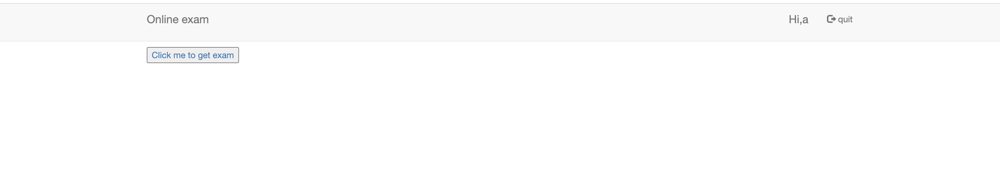

## Unfinished-exam-system

first step just login 

click to get exam

Notice the img can download a image,so try ssrf 

must get png file means it would check the ".png"

but we can use # to bypass 

its a bug hunter trick ,use this we can get  but seems we cant get any flag

Notice this website has a phpinfo we can use it find intranet ip

now try to find intranet host which contains flag

finally http://127.0.0.1:8018/api.php?img=http://192.168.80.3/%23/123.png&username=a  we test and know the host is 192.168.80.3

use base64 decode

get flag